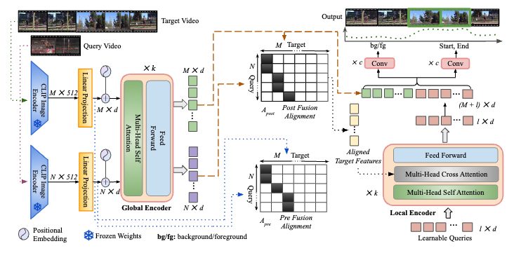
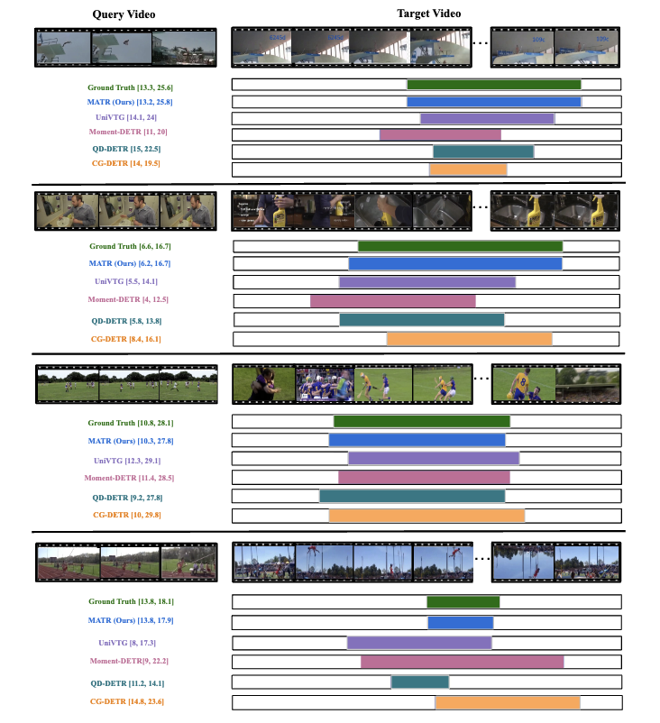

# MATR: Aligning Moments in Time using Video Queries (ICCV 2025)

[](https://github.com/vl2g/MATR/blob/main/assets/kumar_iccv25.pdf)

## Overview
<p align="center">
    
</p>

This repository contains the official code for training, inference, and evaluation of *MATR* from the *ICCV'25* paper ["Aligning Moments in Time using Video Queries"](https://github.com/vl2g/MATR/blob/main/assets/kumar_iccv25.pdf).

## To setup environment
```
# create new env MATR
$ conda create -n MATR python=3.10.4

# activate MATR
$ conda activate MATR

# install pytorch, torchvision
$ conda install -c pytorch pytorch torchvision

# install other dependencies
$ pip install -r requirements.txt
```


## Training 
In order to train *MATR* on our proposed dataset or your own dataset please prepare your dataset annotations following the format in [data](./sportsmoments).
The dataset directory should have the following structure:
```
data/
├── sportsmoment/
│   ├── metadata/
│   │   ├── train.jsonl
│   │   └── val.jsonl
│   ├── txt_clip/
│   ├── target_vid_clip/
│   └── query_vid_clip/
└── ActivityNet/
    ├── metadata/
    │   ├── train.jsonl
    │   └── val.jsonl
    ├── txt_clip/
    ├── target_vid_clip/
    └── query_vid_clip/
```

```
# set the path and required parameters in the train.sh
$ bash train.sh
```


## Inference
[checkpoint](https://drive.google.com/file/d/1C2sKb_JGPY2ho8aM7Lz_4UC2_anP6Stt/view?usp=drive_link)
```
# set the path and required parameters in the inference.py
$ python inference.py
```

## Evaluation
```
# set the path and required parameters in the eval.py
$ python eval.py
```

## Qualitative Results
<p align="center">
    
</p>


## Citation
If you find this work useful, please consider citing it as:
```bibtex
@inproceedings{kumar2025matr,
  title={Aligning Moments in Time using Video Queries},
  author={Yogesh Kumar, Uday Agarwal, Manish Gupta, Anand Mishra},
  booktitle={International Conference on Computer Vision, ICCV},
  year={2025},
}
```
# Acknowledgement
Our codebase is built upon the following open-source repositories:
1. https://github.com/showlab/UniVTG
2. https://github.com/SamsungLabs/Drop-DTW
3. https://github.com/jayleicn/moment_detr

## Contact

Please feel free to open an issue or email us at [yogesh.mcs17.du@gmail.com](mailto:yogesh.mcs17.du@gmail.com) / [ndc.uday@gmail.com](mailto:ndc.uday@gmail.com)
